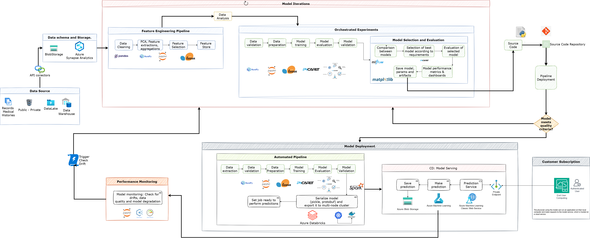

#  Machine Learning Operations (MLOps)

---
## Caso de estudio

### Antecedentes

La explosión de datos en la medicina moderna ha transformado la forma en que entendemos y abordamos la salud. Los registros electrónicos de salud, los dispositivos portátiles generan una cantidad ingente de información sobre los pacientes. Esta riqueza de datos ha impulsado avances significativos en el desarrollo de modelos de aprendizaje automático capaces de predecir enfermedades comunes con una precisión cada vez mayor. Sin embargo, este panorama prometedor se ve desafiado cuando nos enfrentamos a las enfermedades raras o huérfanas. Estas condiciones, que afectan a un número reducido de individuos, se caracterizan precisamente por la escasez de datos disponibles. La falta de suficientes ejemplos dificulta enormemente la aplicación de técnicas tradicionales de aprendizaje automático, que suelen requerir grandes conjuntos de datos para un entrenamiento efectivo. Por lo tanto, el reto radica en desarrollar metodologías innovadoras que puedan construir modelos predictivos robustos incluso con información limitada, cerrando la brecha entre la abundancia de datos para enfermedades comunes y la escasez para las enfermedades huérfanas, con el fin último de mejorar el diagnóstico y la atención de todos los pacientes. 

---

## Definición del problema

Dados los avances tecnológicos, en el campo de la medicina la cantidad de información que existe de los pacientes es muy abundante. Sin embargo, para algunas enfermedades no tan comunes, llamadas huérfanas, los datos que existen escasean. Se requiere construir un modelo que sea capaz de predecir, dados los datos de síntomas de un paciente, si es posible o no que este sufra de alguna enfermedad. Esto se requiere tanto para enfermedades comunes (muchos datos) como para enfermedades huérfanas (pocos datos). 


### Guía de Configuración 

Este proyecto consta de un formulario o aplicación frontend y backend, contenerizadas usando Docker y orquestadas con Docker Compose. El frontend es un archivo HTML estático (`index.html`) servido por Nginx en el puerto 8000, y el backend es una aplicación FastAPI (`application.py`) ejecutándose en el puerto 5000. Este README proporciona instrucciones detalladas para construir y ejecutar cada componente individualmente usando `Dockerfile.frontend` y `Dockerfile.backend`, así como juntos usando `docker-compose.yml`.

## Estructura del Proyecto

```
your_project/
├── Dockerfile.frontend      # Dockerfile para el frontend (Nginx)
├── Dockerfile.backend       # Dockerfile para el backend (FastAPI)
├── docker-compose.yml       # Configuración de Docker Compose para ambos servicios
├── nginx.conf               # Configuración de Nginx para el frontend
├── model/
│   ├── prediction/
│   │   └── application.py   # Aplicación backend FastAPI
│   ├── frontend/
│   │   └── index.html       # Archivo HTML estático del frontend
```

## Requisitos Previos

Antes de continuar, asegúrate de tener instalados los siguientes elementos en tu sistema:

- **Docker**: Versión 20.10 o superior. Instala desde [el sitio oficial de Docker](https://docs.docker.com/get-docker/).
- **Docker Compose**: Versión 2.0 o superior. Normalmente incluido con Docker Desktop, o instálalo por separado siguiendo la [guía de instalación de Docker Compose](https://docs.docker.com/compose/install/).
- **Git** (opcional): Para clonar el repositorio, si aplica.
- **Python 3.9+** (opcional): Solo necesario si deseas inspeccionar o modificar `application.py` localmente.
- Una terminal o interfaz de línea de comandos.

- El backend (`application.py`) es una aplicación FastAPI con una variable `app` definida (por ejemplo, `app = FastAPI()`).
- Existe un archivo `requirements.txt` en `model/prediction/` con dependencias como `fastapi==0.115.0` y `uvicorn==0.30.6`.
- El frontend (`index.html`) es un archivo estático servido por Nginx.
- El sistema tiene acceso a los puertos 8000 (frontend) y 5000 (backend). Si estos puertos están en uso, ajusta los mapeos de puertos en `docker-compose.yml` o detén los servicios en conflicto.

---


---
## Caso de estudio

### Antecedentes

La explosión de datos en la medicina moderna ha transformado la forma en que entendemos y abordamos la salud. Los registros electrónicos de salud, los dispositivos portátiles generan una cantidad ingente de información sobre los pacientes. Esta riqueza de datos ha impulsado avances significativos en el desarrollo de modelos de aprendizaje automático capaces de predecir enfermedades comunes con una precisión cada vez mayor. Sin embargo, este panorama prometedor se ve desafiado cuando nos enfrentamos a las enfermedades raras o huérfanas. Estas condiciones, que afectan a un número reducido de individuos, se caracterizan precisamente por la escasez de datos disponibles. La falta de suficientes ejemplos dificulta enormemente la aplicación de técnicas tradicionales de aprendizaje automático, que suelen requerir grandes conjuntos de datos para un entrenamiento efectivo. Por lo tanto, el reto radica en desarrollar metodologías innovadoras que puedan construir modelos predictivos robustos incluso con información limitada, cerrando la brecha entre la abundancia de datos para enfermedades comunes y la escasez para las enfermedades huérfanas, con el fin último de mejorar el diagnóstico y la atención de todos los pacientes. 

---

## Definición del problema

Dados los avances tecnológicos, en el campo de la medicina la cantidad de información que existe de los pacientes es muy abundante. Sin embargo, para algunas enfermedades no tan comunes, llamadas huérfanas, los datos que existen escasean. Se requiere construir un modelo que sea capaz de predecir, dados los datos de síntomas de un paciente, si es posible o no que este sufra de alguna enfermedad. Esto se requiere tanto para enfermedades comunes (muchos datos) como para enfermedades huérfanas (pocos datos). 

### Origenes de datos

Data Source es un componente fundamental que representa el origen y la infraestructura de almacenamiento de los datos utilizados a lo largo de la pipeline de MLOps. En el contexto de este caso de estudio, la fuente principal es el "Conjunto de Datos de Pacientes: Datos Demográficos y Clínicos". Este conjunto de datos es una recopilación detallada de información de personas diagnosticadas con enfermedades comunes y raras, incluyendo tanto datos demográficos (edad, género, etc.) como información clínica (fecha de diagnóstico, duración de síntomas, diagnósticos previos).
Los datos provienen de orígenes públicos y privados, e incluyen archivos no estructurados, como registros de historias clínicas, así como datos que pueden ser representados en tablas o bases de datos estructuradas.
Para gestionar esta diversidad de datos desde su origen dentro del entorno de Azure, se utilizan varias tecnologías clave:
    
    • Los archivos no estructurados provenientes de fuentes públicas y privadas se almacenan inicialmente en Azure Blob Storage. Este servicio es ideal para manejar millones de archivos con escalabilidad y facilidad de acceso. El almacenamiento en Blob Storage actúa como un Data Lake para estos datos brutos.
    • Después del preprocesamiento necesario para normalizar y limpiar los datos, la información transformada y estructurada se almacena en Azure Synapse Analytics. Este componente funciona como un Data Warehouse, ofreciendo una integración nativa con Azure Blob Storage y capacidades avanzadas para consultas eficientes.
    • Las fuentes de datos pueden ser accedidas a través de API connectors. Herramienta que permite a aplicaciones y servicios en Azure conectarse a API externas, como API REST o SOAP. Facilitan la integración con sistemas y servicios que no son nativos de Azure, permitiendo la ejecución de acciones y la obtención de datos de manera programática. 
        • Integración con API externas:
            Los conectores de API facilitan la interacción con APIs de terceros, como servicios web o sistemas de datos. 
        • Facilidad de uso:
            Simplifican el proceso de conectarse a API, manejando tareas como autenticación, formato de datos y gestión de errores. 
        • Conectores personalizados:
            Azure Logic Apps y otros servicios ofrecen la posibilidad de crear conectores personalizados, que permiten la integración con APIs específicas. 
El acceso a estos datos es el punto de partida para la extracción de datos e inicia el proceso de la pipeline, incluyendo la validación y preparación. La disponibilidad de nuevos datos en el Data Source es un disparador clave para el reentrenamiento automático del modelo (Continuous Training), asegurando que el modelo se mantenga actualizado y evitando su degradación debido a cambios en la distribución de los datos. La validación de datos y el versionamiento de los conjuntos de datos son principios importantes aplicados a la Data Source para asegurar la calidad y reproducibilidad del proceso.

### Almacenamiento y Esquema de datos

"Data Schema and Storage" en la pipeline de MLOps representa la infraestructura y organización de los datos utilizados para el caso de estudio de predicción de enfermedades. Este componente es crucial ya que define dónde y cómo se almacenan los datos, y cómo se asegura su calidad y estructura inicial antes de ser procesados para el entrenamiento del modelo.
Las fuentes de datos provienen de orígenes públicos y privados, e incluyen tanto registros médicos no estructurados como datos que pueden presentarse en bases de datos estructuradas o tablas. Para manejar esta diversidad, los archivos no estructurados, como historias clínicas y datos demográficos brutos de diversas fuentes, se almacenan en Azure Blob Storage. Este servicio actúa como un Data Lake, permitiendo almacenar millones de archivos con escalabilidad y rápida recuperación. Estos datos requieren un preprocesamiento para normalizar formatos y limpiar la información. Posteriormente, los datos transformados y estructurados se almacenan en Azure Synapse Analytics. Azure Synapse funciona como un Data Warehouse, ofreciendo integración nativa con Azure Blob Storage y capacidades avanzadas para consultas SQL eficientes, lo cual es ideal para preparar los conjuntos de datos para el entrenamiento de modelos de Machine Learning.
El concepto de "Data Schema" aquí se refiere a la definición y validación de la estructura y el dominio de los datos. Esto es una parte fundamental de la validación de datos, donde se calculan estadísticas y se define un esquema para los datos de entrada. Asegurar un esquema consistente es vital para la calidad del entrenamiento y para monitorear la calidad de los datos y evitar desviaciones en producción.

Data Cleaning (Limpieza de Datos) es fundamental y se aplica después de la ingesta inicial. Su objetivo es abordar elementos críticos como campos faltantes, archivos corruptos, incompatibilidades de tipo y la detección y tratamiento de casos atípicos inesperados. Este paso garantiza la calidad y consistencia de los datos brutos provenientes de diversas fuentes públicas y privadas.
Una vez que los datos están limpios y preparados, se inicia la fase de ingeniería de características. Esto incluye procesos como el Análisis de Componentes Principales (PCA), que se utiliza para reducir la dimensionalidad del conjunto de datos conservando la mayor parte de la información relevante, mejorando la eficiencia computacional. La extracción de características identifica variables críticas, mientras que las agregaciones consolidan los datos en resúmenes significativos. La selección de características se encarga de definir el conjunto final de variables que se utilizarán para entrenar el modelo.
Para gestionar de manera eficiente estas características procesadas, se utiliza un Feature Store. Este repositorio es esencial para reutilizar características en múltiples modelos y proyectos, evitando la duplicación de esfuerzos en la ingeniería de características. También ayuda a deacoplar el proceso de ingeniería de características del entrenamiento y la inferencia, asegurando la consistencia entre el entrenamiento y el servicio del modelo. Los Data Scientists pueden acceder al Feature Store para encontrar características existentes o agregar nuevas características procesadas. En una arquitectura MLOps avanzada, el Feature Store se convierte en el punto de acceso principal para los datos de características, en lugar de conectarse directamente a los data warehouses o fuentes de datos originales.
Para implementar estos procesos en Azure, se pueden utilizar varias tecnologías. Azure Synapse Analytics y Azure Databricks con Spark son plataformas adecuadas para realizar el preprocesamiento, la limpieza de datos, la ingeniería de características y el análisis exploratorio de datos a escala, especialmente con grandes volúmenes de datos. El Feature Store en Azure se puede implementar utilizando una combinación de servicios de almacenamiento y procesamiento, y Azure Machine Learning ofrece funcionalidades de Feature Store. Herramientas de Python como Pandas y NumPy son comúnmente utilizadas en la limpieza y procesamiento de datos, y scikit-learn para PCA y selección de características, a menudo ejecutadas en entornos como Azure Databricks o Azure ML Compute instances. [link](https://pycaret.gitbook.io/docs) PyCaret, como contenedor de estas bibliotecas, puede simplificar y automatizar muchas de estas tareas de preprocesamiento y experimentación

---
## Iteraciones del modelo

### Proceso de ingeniería de caracteristicas

Data Cleaning (Limpieza de Datos) es fundamental y se aplica después de la ingesta inicial. Su objetivo es abordar elementos críticos como campos faltantes, archivos corruptos, incompatibilidades de tipo y la detección y tratamiento de casos atípicos inesperados. Este paso garantiza la calidad y consistencia de los datos brutos provenientes de diversas fuentes públicas y privadas.
Una vez que los datos están limpios y preparados, se inicia la fase de ingeniería de características. Esto incluye procesos como el Análisis de Componentes Principales (PCA), que se utiliza para reducir la dimensionalidad del conjunto de datos conservando la mayor parte de la información relevante, mejorando la eficiencia computacional. La extracción de características identifica variables críticas, mientras que las agregaciones consolidan los datos en resúmenes significativos. La selección de características se encarga de definir el conjunto final de variables que se utilizarán para entrenar el modelo.
Para gestionar de manera eficiente estas características procesadas, se utiliza un Feature Store. Este repositorio es esencial para reutilizar características en múltiples modelos y proyectos, evitando la duplicación de esfuerzos en la ingeniería de características. También ayuda a deacoplar el proceso de ingeniería de características del entrenamiento y la inferencia, asegurando la consistencia entre el entrenamiento y el servicio del modelo. Los Data Scientists pueden acceder al Feature Store para encontrar características existentes o agregar nuevas características procesadas. 
En una arquitectura MLOps avanzada, el Feature Store se convierte en el punto de acceso principal para los datos de características, en lugar de conectarse directamente a los data warehouses o fuentes de datos originales.
Para implementar estos procesos en Azure, se pueden utilizar varias tecnologías. Azure Synapse Analytics y Azure Databricks con Spark son plataformas adecuadas para realizar el preprocesamiento, la limpieza de datos, la ingeniería de características y el análisis exploratorio de datos a escala, especialmente con grandes volúmenes de datos. El Feature Store en Azure se puede implementar utilizando una combinación de servicios de almacenamiento y procesamiento, y Azure Machine Learning ofrece funcionalidades de Feature Store. Herramientas de Python como Pandas y NumPy son comúnmente utilizadas en la limpieza y procesamiento de datos, y scikit-learn para PCA y selección de características, a menudo ejecutadas en entornos como Azure Databricks o Azure ML Compute instances.[link](https://pycaret.gitbook.io/docs)  PyCaret, como contenedor de estas bibliotecas, puede simplificar y automatizar muchas de estas tareas de preprocesamiento.

### Experimentos orquestados

1. **Data Validation**: Este proceso es fundamental para asegurar la calidad de los datos de entrada. Implica verificar automáticamente el esquema y el dominio de los datos y las características, calculando estadísticas a partir de los datos de entrenamiento para definir expectativas. Es vital para detectar errores tempranamente y asegurar que los datos coincidan con la estructura esperada. Las tecnologías de Azure como Azure Synapse Analytics y Azure Databricks pueden utilizarse para realizar estas verificaciones a escala, a menudo implementadas con bibliotecas como Pandas y Numpy.
2. **Data Preparation**: Esta etapa se enfoca en limpiar y transformar los datos validados para hacerlos adecuados para el entrenamiento del modelo. Incluye la limpieza de datos (manejo de valores faltantes, corrección de errores), análisis exploratorio de datos (EDA) para comprender las características, y transformaciones necesarias. Este proceso alimenta la pipeline de ingeniería de características. Plataformas como Azure Synapse Analytics y Azure Databricks con Apache Spark son ideales para ejecutar estas tareas de procesamiento de datos a gran escala.
3. **Model Training**: Aquí se desarrollan los algoritmos predictivos utilizando los datos preparados. Implica la experimentación con diferentes modelos y la optimización de sus parámetros. El objetivo es obtener un modelo con calidad estable. Se utilizan bibliotecas como scikit-learn y [link](https://pycaret.gitbook.io/docs) PyCaret, a menudo ejecutadas en entornos de computación escalables de Azure. El entrenamiento debe ser reproducible y puede ser parte de una pipeline automatizada disparada por nuevos datos.
4. **Model Evaluation**: Una vez entrenados, los modelos se evalúan para medir su rendimiento. Para tareas de clasificación, se revisan métricas como ROC AUC, F1-score, accuracy, y la Confusion matrix. También se considera la complejidad del modelo y los tiempos de inferencia. Se utiliza validación cruzada para probar el modelo con diferentes subconjuntos de datos. Los resultados se registran y pueden visualizarse en paneles (por ejemplo, con Matplotlib + MLflow) para la toma de decisiones.
5. **Model Validation**: Este es un paso crítico para decidir si el modelo entrenado está listo para ser desplegado en producción. Se realiza una evaluación exhaustiva para verificar si el modelo cumple con los criterios mínimos de calidad (accuracy, rendimiento, etc.) definidos previamente. Si el modelo satisface estos umbrales, avanza al despliegue; de lo contrario, se regresa a las fases anteriores (iteración, entrenamiento). Esta validación incluye probar la posible degradación del modelo en un conjunto de validación y verificar la consistencia entre el entorno de entrenamiento y servicio.
Estos procesos se integran en una pipeline automatizada, donde la validación de datos y modelos, así como el entrenamiento, pueden ser disparados automáticamente, asegurando la calidad y eficiencia en el ciclo de vida del MLOps.

#### Selección y evaluación del modelo

Comparación, Selección y Evaluación de Modelos son etapas críticas después del entrenamiento iterativo.
Tras realizar múltiples Iteraciones del Modelo, que implican la experimentación con diferentes algoritmos y la optimización de parámetros, se procede a la Comparación entre modelos. Esta fase implica evaluar los candidatos entrenados basándose en métricas importantes para la clasificación, tales como:

- **ROC AUC**
- **F1-score**
- **Accuracy**
- **Matriz de Confusión**

Adicionalmente, se consideran criterios no puramente estadísticos como:

- **Tiempos de inferencia**
- **Complejidad computacional (espacial y temporal)**
- **Consumo de recursos durante la inferencia**

Para asegurar la robustez del análisis comparativo, se implementa validación cruzada mediante esquemas como **k-fold cross-validation**, lo que permite evaluar el desempeño de los modelos en múltiples subconjuntos del conjunto de datos.

Herramientas como **Azure Machine Learning** (a través de su SDK y portal web) permiten orquestar este proceso de comparación, con soporte adicional para bibliotecas como [link](https://pycaret.gitbook.io/docs) PyCaret facilitan este proceso de comparación, y MLflow junto con Matplotlib pueden utilizarse para registrar y visualizar los resultados de estas comparaciones.

Una vez realizada la comparación, se procede a la Selección del mejor modelo según los requisitos. Esta selección se fundamenta en el análisis comparativo y debe alinearse con los criterios predefinidos, que pueden incluir requisitos de negocio, recursos, tiempos de inferencia y facilidad de uso.
El modelo seleccionado pasa por una Evaluación del modelo seleccionado, también llamada Model Validation. Este es un paso crucial para determinar si el modelo cumple con los criterios mínimos de calidad necesarios para ser implementado en producción. Se verifica si el modelo satisface los umbrales establecidos en cuanto a accuracy y rendimiento. Si no los cumple, el proceso regresa a la fase de iteración y experimentación.
Durante estas fases, se generan Model performance metrics & dashboards. Las métricas de rendimiento se registran y visualizan, a menudo utilizando herramientas como MLflow y Matplotlib, o potencialmente Tableau, para fundamentar la decisión de selección y presentarla a las partes interesadas. Estas métricas son esenciales para el Monitoreo del Modelo en producción, donde se verifica la calidad y se detectan problemas como la degradación del modelo y los cambios en la distribución de datos (drift). Azure Monitor es una tecnología de Azure recomendada para el monitoreo del rendimiento del modelo en producción.
Finalmente, después de la selección y validación, es fundamental Save model, params and artifacts. El modelo elegido, junto con sus parámetros y artefactos asociados, se serializa (por ejemplo, usando formatos como pickle o protobuf) y se guarda en un repositorio. 


Una vez finalizadas estas estapas del Pipelne de MLOPs es curcial establecer donde se versionan y almacenan los modelos y su metadata, asegurando la Reproducibilidad y auditabilidad del proceso. Esto se relaciona con el concepto de Model Registry y Experiment TrackingLas, las tecnologías de Azure, como Azure Machine Learning, ofrecen funcionalidades para el registro y versionamiento de modelos.

#### Evaluación del Modelo Seleccionado

Una vez identificado el modelo con mejor desempeño según los criterios definidos, se procede a su **evaluación final** en una etapa conocida como **validación del modelo**. Esta validación permite verificar si el modelo cumple con los requisitos mínimos de calidad, rendimiento y confiabilidad antes de su paso a producción.

Durante esta fase se evalúa si el modelo:

- Alcanza o supera los umbrales de rendimiento (accuracy, AUC, etc.)
- Tiene tiempos de respuesta aceptables bajo condiciones reales
- Es robusto ante variaciones en los datos de entrada
- Cumple con restricciones del negocio o regulatorias

    Si el modelo no cumple con estos criterios, el flujo de trabajo regresa a la etapa de iteración para ajustes adicionales.
---

## Despliegue del modelo

Model Deployment (Implementación del Modelo) es una fase crítica y automatizada dentro de la pipeline de machine learning. Su objetivo principal es poner a disposición el modelo validado para que pueda ser consumido y generar predicciones en los entornos disponibles calidad, preproducción o producción.
Este proceso se ejecuta después de que el modelo ha pasado por las fases de iteraciones, selección, evaluación y, crucialmente, validación, asegurando que cumple con los criterios mínimos de calidad definidos. Según los principios de MLOps, la implementación debe ser un paso automatizado, a menudo integrado en una pipeline de CI/CD (Continuous Delivery).

### Proceso automatizado

Para garantizar una solución escalable, reproducible y robusta, se ha definido un pipeline automatizado que cubra todo el ciclo de vida del modelo, desde la extracción de datos hasta su despliegue como servicio web. Este pipeline ha sido diseñado para soportar grandes volúmenes de datos clínicos y generar predicciones de forma eficiente, utilizando las capacidades de computación distribuida de Azure y la interoperabilidad de Azure Machine Learning Classic Web Service.

#### Etapas del Pipeline

A continuación, se detallan las principales etapas del pipeline automatizado:

1. **Extracción de Datos (Data Extraction)**: Los datos clínicos estructurados y no estructurados se extraen desde sistemas fuente como bases de datos hospitalarias, archivos planos (CSV, JSON, Parquet) o almacenamiento en la nube. Este proceso puede ser ejecutado a través de servicios como **Azure Data Factory** o **Azure Synapse Pipelines**, garantizando conectividad segura y transferencia eficiente de grandes volúmenes de datos.
2. **Validación de Datos (Data Validation)**: Durante esta etapa se aplican reglas para verificar la integridad, consistencia y completitud de los datos. Se identifican valores nulos, rangos inválidos, duplicados o formatos inconsistentes. Esta validación es fundamental para asegurar que los datos alimenten correctamente al modelo. Se recomienda el uso de bibliotecas como **Great Expectations** o validadores personalizados en **PySpark**.
3. **Preparación de Datos (Data Preparation)**: Los datos validados se transforman mediante técnicas como normalización, codificación de variables categóricas, imputación de valores faltantes y selección de características relevantes. Esta transformación puede ser paralelizada utilizando **Azure Databricks con Spark**, especialmente en contextos de procesamiento de millones de registros clínicos.
4. **Entrenamiento del Modelo (Model Training)**: Una vez preparados los datos, se procede al entrenamiento del modelo utilizando algoritmos de *machine learning* seleccionados en función del problema (por ejemplo, clasificación binaria, regresión). Este proceso puede realizarse en entornos distribuidos como **Azure ML Compute Clusters** o **Databricks**, optimizando el uso de recursos y tiempos de entrenamiento.
5. **Evaluación del Modelo (Model Evaluation)**: Tras el entrenamiento, se evalúa el desempeño del modelo utilizando métricas apropiadas como AUC, precisión, recall o F1-score. Los resultados se visualizan y documentan para comparar entre versiones o configuraciones del modelo.
6. **Validación del Modelo (Model Validation)**: Antes del despliegue, el modelo es validado con un conjunto de datos no visto para asegurar su generalización y robustez. Esta etapa incluye validación cruzada, pruebas en subconjuntos sensibles (ej. por grupo demográfico) y detección de sesgos.
7. **erialización y Exportación del Modelo (Serialize and Export)**: El modelo validado se serializa utilizando formatos estándar como **Pickle** o **Protobuf**, y se exporta a un entorno distribuido para su ejecución a gran escala. Si el volumen de datos requiere procesamiento paralelo, se puede utilizar un clúster de **Azure Databricks** o **HDInsight con Spark**, donde se configura un "job" que aplica el modelo serializado sobre los datos.

> Alternativamente, para casos donde se necesita orquestación avanzada y despliegue escalable, se sugiere el uso de **Azure Kubernetes Service (AKS)** para encapsular la lógica de predicción en contenedores gestionados.
 
###  Modelo como servicio

#### Operación en Entorno Productivo

Una vez implementado en el entorno productivo, el sistema de predicción médica operará con **disponibilidad ininterrumpida** las 24 horas del día, los 7 días de la semana. Esta disponibilidad garantiza acceso permanente y confiable para el personal médico autorizado, permitiendo el uso continuo de las predicciones como herramienta de apoyo en la toma de decisiones clínicas.

La arquitectura ha sido diseñada bajo un modelo de **servicio bajo demanda**, en el cual las predicciones se generan en tiempo real mediante la invocación de un **Azure Machine Learning Classic Web Service**. 

#### Almacenamiento de Predicciones del modelo
Cada predicción generada por el modelo de *machine learning* será almacenada de forma estructurada en la nube, utilizando los servicios de **Azure Storage**. Esta capa de persistencia está diseñada para cumplir con los requerimientos de escalabilidad, integridad, trazabilidad y rendimiento exigidos en entornos hospitalarios.

Se utilizarán los siguientes servicios específicos dentro del ecosistema de Azure:

- **Azure Blob Storage**: Para almacenar resultados en formatos JSON o CSV, con soporte para almacenamiento masivo y recuperación eficiente.
- **Azure Table Storage** o **Azure Cosmos DB**: Para persistir registros tabulares que requieran consultas rápidas, filtrado o acceso frecuente desde sistemas analíticos o de auditoría.

#### Predicciones del modelo
Cada predicción generada por el modelo de machine learning se utiliza como insumo para la toma de decisiones médicas y se almacena de forma estructurada en Azure Storage, asegurando la persistencia, trazabilidad y disponibilidad de los datos. Para ello, se emplean servicios como Azure Blob Storage para archivos en formatos JSON o CSV, y soluciones como Azure Table Storage o Azure Cosmos DB para registros tabulados y consultas eficientes.

Además, se deben integrar medidas avanzadas de seguridad y cumplimiento normativo para garantizar la protección de los datos sensibles:

Cifrado de datos en tránsito y en reposo, utilizando protocolos como TLS y cifrado AES-256.
Autenticación y control de acceso basado en roles (RBAC), asegurando que solo usuarios autorizados puedan acceder a las predicciones.
Cumplimiento con regulaciones internacionales de privacidad de datos, como el Reglamento General de Protección de Datos (GDPR) para usuarios en la Unión Europea y la Ley de Portabilidad y Responsabilidad de Seguros de Salud (HIPAA) para el sector salud en EE. UU.
Monitorización y auditoría continua mediante herramientas de Azure como Azure Monitor, Azure Policy y Microsoft Defender for Cloud, para detectar accesos no autorizados o configuraciones inseguras.
Esta estrategia garantiza no solo la disponibilidad y utilidad de las predicciones del modelo, sino también el cumplimiento con los más altos estándares de privacidad, ética y protección de la información en entornos clínicos sensibles.

#### Predicciones como Servicio  [Azure Machine Learning Classic Web Service]

Este servicio expone una API RESTful segura que permite enviar datos de entrada al modelo y obtener respuestas de manera inmediata, integrándose fácilmente con los sistemas clínicos existentes (por ejemplo, historia clínica electrónica, paneles de decisión médica, entre otros). El uso de **Azure Machine Learning Classic Web Service** permite:

- **Despliegue rápido y confiable** del modelo como un servicio web escalable.
- **Interfaz RESTful** compatible con múltiples plataformas de software médico.
- **Actualización del modelo sin interrupciones**, permitiendo mejorar la precisión sin afectar la disponibilidad del servicio.
- **Control de versiones**, asegurando reproducibilidad y trazabilidad de las respuestas del modelo.

### Subscripción y Consumo del Servicio de Predicción

### Modelo de Consumo por el Usuario Final

El acceso a las predicciones generadas por el modelo de *machine learning* se ofrece bajo un enfoque flexible de consumo, diseñado para adaptarse a diferentes entornos de trabajo del personal médico. Los profesionales de la salud (usuarios finales) pueden interactuar con el sistema predictivo de dos formas principales:

#### a) Ejecución Local

Si los recursos computacionales requeridos por el modelo son mínimos y el contexto clínico lo permite, el modelo puede ser descargado y ejecutado localmente en la estación de trabajo del médico. Esta modalidad requiere un entorno previamente configurado (por ejemplo, mediante entornos virtuales o contenedores) que permita ejecutar el modelo de forma segura y reproducible.

#### b) Consumo como Servicio Web en la Nube

Como opción principal y recomendada, el modelo está desplegado en la nube mediante **Azure Machine Learning Classic Web Service**, lo cual permite su consumo remoto a través de una **API RESTful** expuesta de forma segura.

La aplicación clínica (por ejemplo, una historia clínica electrónica, dashboard médico o aplicación móvil especializada) puede realizar peticiones HTTP al servicio de predicción, enviando los datos clínicos relevantes y recibiendo una respuesta inmediata con la predicción generada por el modelo. Esta arquitectura desacopla completamente al usuario final de la infraestructura computacional y asegura una experiencia de uso transparente y eficiente.

### Autenticación y Seguridad en el Acceso

El acceso al servicio está protegido mediante mecanismos de autenticación robustos, como el uso de **token de suscripción** o **OAuth 2.0**, dependiendo de la configuración del entorno. Adicionalmente, se aplican políticas de **control de acceso basado en roles (RBAC)** para definir qué usuarios o sistemas pueden realizar peticiones y acceder a los resultados de predicción.

Este modelo asegura que solo personal autorizado pueda consumir el servicio, en conformidad con los estándares de privacidad de la información médica (como **HIPAA** y **GDPR**).


#### Monitoreo del Modelo

Monitoreo del Modelo es un proceso altamente recomendable y crítico que se lleva a cabo una vez que el modelo ha sido implementado en producción. Aunque inicialmente pueda no ser un requisito inmediato, es una fase estratégica para asegurar la calidad continua del sistema de predicción.
Este proceso implica la monitorización exhaustiva del modelo para identificar desviaciones, problemas de calidad de datos y degradación del rendimiento predictivo. Se enfoca en controlar el rendimiento del modelo en datos en vivo, verificando la calidad y detectando problemas como el data drift y la model degradation. Principios como el Continuous Monitoring (CM) se centran en monitorear las métricas de rendimiento del modelo en producción, las cuales están ligadas a métricas de negocio.

La implementación de una solución como Azure Monitor facilita la detección temprana de anomalías, permitiendo adoptar medidas correctivas proactivas antes de que los problemas afecten negativamente. El sistema puede configurarse para generar notificaciones automáticas cuando los indicadores de rendimiento se desvían de los parámetros esperados. El monitoreo continuo ayuda a identificar cuándo el modelo se vuelve stale (obsoleto) y a determinar con qué frecuencia debe reentrenarse. Se deben monitorear cambios en la distribución de los datos y si las características de entrenamiento y servicio computan el mismo valor.

Crucialmente, el monitoreo puede disparar el reentrenamiento del modelo. Si el sistema detecta una disminución significativa en el rendimiento o un drift de datos, puede trigger para ejecutar el pipeline o iniciar un nuevo ciclo de experimentación. Esto crea un ciclo automatizado que retorna a la etapa de iteración del modelo para reentrenarlo con datos actualizados y posteriormente volver a implementarlo. Herramientas como MLflow y Matplotlib pueden usarse para visualizar métricas de rendimiento en dashboards. El monitoreo es vital para mantener la calidad y fiabilidad del modelo en producción y asegurar que cumple su objetivo.

  - Se utiliza **Azure Monitor**, **Microsoft Defender for Cloud** y **Azure Policy** para monitoreo continuo, generación de alertas, revisión de configuraciones y cumplimiento de políticas de seguridad.
  - Se habilita **registro de auditoría** para todos los accesos y cambios sobre los recursos que manejan datos de predicción.


#### Seguridad y Cumplimiento Normativo

Dado que las predicciones pueden incluir información sensible relacionada con pacientes o diagnósticos, se han considerado de forma integral los aspectos de **seguridad de la información**, **privacidad de datos** y **cumplimiento normativo**. La solución implementa las siguientes medidas y prácticas:

- **Cifrado de Datos**
  - Todos los datos en tránsito y en reposo están cifrados utilizando estándares de la industria, como **TLS 1.2+** y **AES-256**.
  
- **Control de Acceso**
  - El acceso a los datos almacenados está protegido mediante **Azure Active Directory (AAD)** y **control de acceso basado en roles (RBAC)**, asegurando que únicamente usuarios autorizados y autenticados puedan acceder a las predicciones.

- **Cumplimiento con Normativas**
  - El almacenamiento y tratamiento de datos está alineado con regulaciones clave:
    - **HIPAA** (Health Insurance Portability and Accountability Act), en contextos de salud en EE. UU.
    - **GDPR** (General Data Protection Regulation), para datos de usuarios en la Unión Europea.
  - Se incluyen políticas de retención de datos, anonimización, consentimiento explícito y derecho de acceso, rectificación y eliminación de datos personales.


#### Integración y Escalabilidad

El sistema ha sido diseñado de forma modular, permitiendo la integración con otros sistemas hospitalarios mediante API RESTful seguras. Asimismo, la solución está preparada para escalar horizontalmente, soportando un aumento en la demanda sin afectar el rendimiento ni la latencia de las predicciones.
